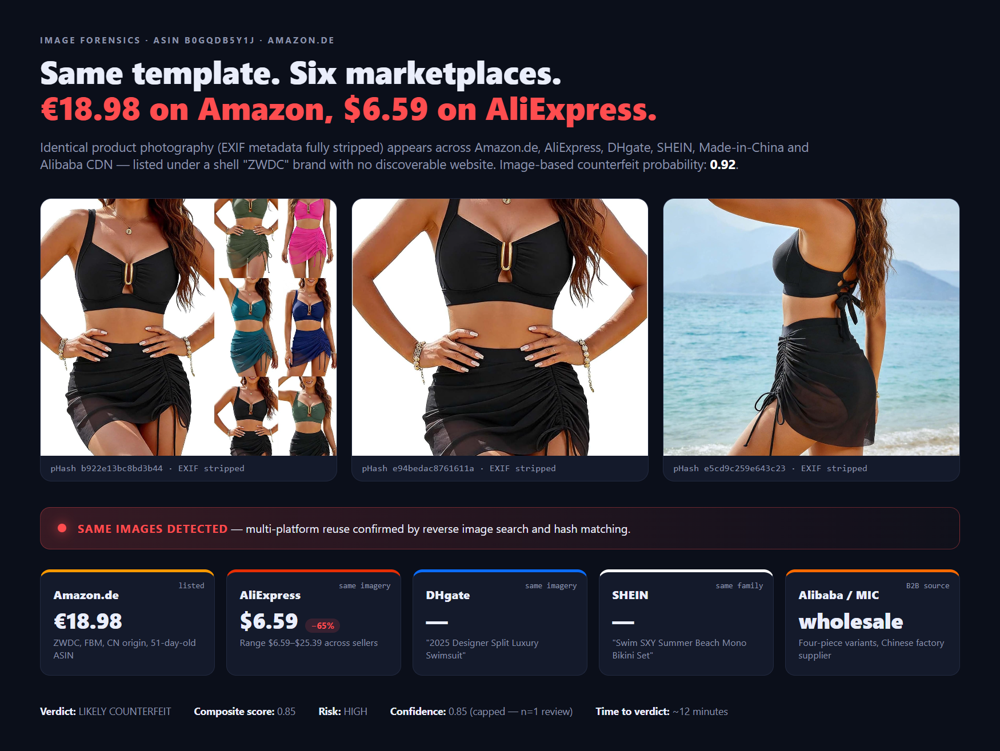

# Fake Product Detector

**An AI-powered multi-agent system for detecting counterfeit products on Amazon and OTTO.de marketplaces**


---

## Overview

This project uses a multi-agent architecture powered by **Claude Code** to analyze marketplace products for counterfeit indicators, combining:

- **Natural Language Processing** on customer reviews (English and German)
- **Computer Vision** for image forensics and reverse image search
- **Network Analysis** to detect seller collusion patterns
- **Seller Ethics Vetting** against a configurable prohibited-practices checklist
- **Research-backed feature weighting** validated by academic literature

## Platforms

**Just paste the product link.** You don't have to extract an ASIN or article number by hand — `/investigate` accepts the raw product URL and parses the ID for you. Plain IDs still work if you have them.

| Platform | Command | Accepts |
|----------|---------|---------|
| Amazon (all TLDs: .com, .de, .co.uk, .fr, ...) | `/investigate [input]` | Product URL (e.g. `https://www.amazon.de/dp/B08TMTFR6B`) **or** ASIN (`B08TMTFR6B`) |
| OTTO.de | `/investigate [input]` | Product URL (e.g. `https://www.otto.de/p/...1789019591/`) **or** article number (`1789019591`) |

A single `/investigate` command auto-detects the platform from the input (URL host or ID shape). All Amazon TLDs are supported.

---

## Why I built this

I have worked at **OTTO Group** in Hamburg — one of Europe's largest e-commerce retailers — on a project with the team responsible for detecting non-compliant and counterfeit sellers on the OTTO marketplace.

The process back then:

- **Manual review queues** — analysts working through flagged listings one by one.
- **External supplier workflows** — specialist fraud vendors paid per seller for background checks that took days.
- **Reactive** — most counterfeit detection happened *after* a brand holder complained, not before a customer was deceived.
- **Costly** — every deep investigation was hours of human labor plus vendor fees, which made scaling across tens of thousands of sellers economically impossible.

What we built worked, but it did not scale with the marketplace. Every new seller cohort meant more headcount or a bigger vendor bill. Non-compliant Seller on Marketplaces were rarely *only* about counterfeit — it is child-labor supply chains surfacing in audits, extremist or Nazi iconography drifting into catalogs, animal-cruelty flags, sanctioned entities trying to onboard through shell companies. Each of those categories was and is a separate human investigation.

Two things have changed since then: the academic literature on counterfeit detection matured (see [Scientific Foundation](#scientific-foundation)), and AI agents became good enough to *read* a listing page, reverse-search its images across AliExpress and DHgate, run German-language review NLP, and cross-check seller registrations — all in the same reasoning session, for cents per listing.

This project is that concept rebuilt end-to-end as an AI-driven system, with the OTTO-era **ethics checklist** captured as machine-readable YAML rules (see [Seller Ethics Vetting](#seller-ethics-vetting)) and with explicit alignment to **EU DSA Article 30** obligations (see [DSA Article 30 coverage](#dsa-article-30-coverage)).

---

## Quick Start

```bash
# Start Claude Code
cd fake-product-detector
claude

# Full investigation (auto-detects Amazon or OTTO)
# Amazon:
/investigate B08TMTFR6B
/investigate https://www.amazon.de/dp/B08TMTFR6B

# OTTO:
/investigate 1789019591
/investigate https://www.otto.de/p/lascana-kurzarmshirt-mit-zierknopfleiste-1789019591/

# Step-by-step (Amazon)
/listing B08TMTFR6B
/reviews B08TMTFR6B
/images B08TMTFR6B
/seller B08TMTFR6B
/verdict B08TMTFR6B

# Step-by-step (OTTO)
/otto-listing 1789019591
/otto-reviews 1789019591
/otto-images 1789019591
/otto-seller 1789019591
/otto-verdict 1789019591
```

After every verdict, validation and an HTML report are auto-generated:
```bash
# Amazon
python3 validate_verdict.py B08TMTFR6B
python3 generate_report.py B08TMTFR6B

# OTTO
python3 validate_otto_verdict.py 1789019591
python3 generate_otto_report.py 1789019591
```

---

## What you get

Every investigation produces a **standalone HTML report you can open in any browser** — no server, no dependencies, no dashboard to configure. Just a single file that tells the story of the listing in plain language.

The report includes, all on one page:

- **Headline verdict** — `LIKELY AUTHENTIC` / `UNCERTAIN` / `LIKELY COUNTERFEIT` plus a composite-score gauge and risk category.
- **Evidence for / against authenticity** — two side-by-side lists so you can see the trade-off at a glance.
- **Top risk flags** — each with a severity pill (HIGH / MEDIUM / LOW) and a one-line reason citing the underlying signal.
- **Scored signal breakdown** — weights, values, and contributions per signal (for the analyst / auditor who wants the math).
- **Seller profile + ethics-checklist outcome** — KYB findings, seller metrics, and which prohibited-practices entries fired.
- **Buying recommendation** — plain-language guidance and any alternatives.
- **Sources** — every underlying JSON artifact is referenced so findings are traceable.

Alongside the HTML, you also get a **machine-readable `verdict.json`** (schema-validated) — audit-ready, DSA-notice-exportable, and easy to ingest into dashboards or downstream pipelines.

| Artifact | Path | For whom |
|---|---|---|
| HTML report | `verdicts/{ASIN}_report.html` | Humans — analysts, buyers, compliance teams |
| Structured verdict | `verdicts/{ASIN}_verdict.json` | Machines — audit trails, trusted-flagger notices, dashboards |
| Per-agent artifacts | `products/` · `reviews/` · `images/` · `sellers/` | Deep-dive traceability |

### Sample report

A real investigation of Amazon.de ASIN `B0GQDB5Y1J` (a €19 tankini listed under the shell brand "ZWDC") is bundled in the repo so you can see the exact output without running anything:

- 👀 **Live render in your browser:** [B0GQDB5Y1J_report.html (via htmlpreview)](https://htmlpreview.github.io/?https://github.com/PAST2212/fake-product-detector/blob/main/docs/samples/B0GQDB5Y1J_report.html)
- 📁 **Source files:** [`docs/samples/B0GQDB5Y1J_report.html`](docs/samples/B0GQDB5Y1J_report.html) · [`docs/samples/B0GQDB5Y1J_verdict.json`](docs/samples/B0GQDB5Y1J_verdict.json)

Verdict: **LIKELY COUNTERFEIT · composite score 0.85 · risk HIGH.** The full story behind this case is in [docs/medium-article.md](docs/medium-article.md).

---

## Architecture

### Investigation Pipeline

```
Input (ASIN or article number)
        ↓
Platform Detection
        ↓
┌───────────┬────────────┬──────────────┐
│  Listing  │   Reviews   │   Images     │
│  (scrapes)│  (German   │  (pHash +    │
│  price,   │  NLP for   │  reverse     │
│  sellers,  │  "gefälscht")│  image       │
│  fulfill.) │             │  search)     │
└───────────┴────────────┴──────────────┘
        ↓
┌─────────────────────┐
│   Seller Investigator │  ← also runs ethics checklist
│  (network graph,     │     against config/seller-
│   account age,       │     ethics-checklist.yaml
│   FBA/FBM)           │
└─────────────────────┘
        ↓
┌─────────────────────────────┐
│   Fake Product Classifier    │
│  (composite score + verdict) │
└─────────────────────────────┘
        ↓
    Verdict JSON + HTML Report
```

### Agents

**Amazon:** `product-researcher` · `image-forensics` · `review-analyst` · `seller-investigator` · `fake-product-classifier` · `web-search` · `data-scraper`

**OTTO:** `otto-product-researcher` · `otto-image-forensics` · `otto-review-analyst` · `otto-seller-investigator` · `otto-fake-product-classifier`

### Skills (domain knowledge, loaded on demand)

| Skill | Purpose |
|-------|---------|
| `counterfeit-methodology` | Scoring weights, verdict thresholds, category base rates |
| `amazon-patterns` | FBA/FBM signals, ASIN hijacking, review manipulation |
| `otto-patterns` | OTTO seller types, German comparators (Idealo, Check24), EU regulatory context |

---

## Data Storage

```
fake-product-detector/
├── products/                   # Amazon listing data
├── reviews/                   # Amazon review analysis
├── images/                    # Amazon image forensics
├── sellers/                    # Amazon seller profiles
├── verdicts/                  # Amazon verdicts + HTML reports
│
├── otto-products/              # OTTO listing data
├── otto-reviews/              # OTTO review analysis
├── otto-images/               # OTTO image forensics
├── otto-sellers/              # OTTO seller profiles
├── otto-verdicts/             # OTTO verdicts + HTML reports
│
├── scraped/                   # Raw scraped data
├── search/                    # Web search results
├── config/
│   └── seller-ethics-checklist.yaml   # Prohibited-practices checklist
│
├── validate_verdict.py        # Amazon verdict validator
├── validate_otto_verdict.py   # OTTO verdict validator
├── generate_report.py         # Amazon HTML report
└── generate_otto_report.py    # OTTO HTML report
```

---

## Methodology

### Detection Tiers

| Tier | When | Signals |
|------|------|---------|
| **Pre-Purchase** | Before buying | Review NLP, image forensics, seller networks, listing metadata |
| **At-Purchase** | Checkout | Fulfillment type (FBA vs FBM / OTTO vs Händlerversand), seller choice |
| **Post-Purchase** | Physical inspection | Packaging, barcodes, product verification |

### Scoring Weights (from `counterfeit-methodology` skill)

| Signal | Weight |
|--------|-------:|
| Fake topic score (review keywords) | 0.222 |
| Sentiment mismatch (stars vs text) | 0.167 |
| Unauthorized marketplace image match | 0.167 |
| Seller network centrality | 0.089 |
| Cross-ASIN / cross-listing image sharing | 0.089 |
| Shared reviewers | 0.078 |
| Account age | 0.056 |
| Feedback score | 0.056 |
| Seller count on listing | 0.044 |
| Price variance | 0.032 |

Category base rate (fragrances/cosmetics HIGH, books/groceries LOW) is applied as a post-composite adjustment, not a weighted signal.

### Verdict Thresholds

| Score | Verdict | Confidence |
|-------|---------|------------|
| < 0.20 | LIKELY AUTHENTIC | High |
| 0.20 – 0.39 | LIKELY AUTHENTIC | Medium |
| 0.40 – 0.59 | UNCERTAIN | — |
| 0.60 – 0.79 | LIKELY COUNTERFEIT | Medium |
| ≥ 0.80 | LIKELY COUNTERFEIT | High |

Boundary 0.80 is inclusive. Confidence is capped at 0.95.

### Category Base Rates

| Category | Risk |
|----------|------|
| Fragrances, Cosmetics | HIGH |
| Fashion, Electronics accessories | MEDIUM |
| Books, Groceries | LOW |

---

## Seller Ethics Vetting

Every seller investigation runs an **ethics checklist** against `config/seller-ethics-checklist.yaml`.

This checks the seller/brand against prohibited practices including:

- **Human Rights** — child labor, forced labor, wage theft
- **Ideological** — extremist ideology, Nazi, hate speech
- **Animal Welfare** — animal cruelty, exotic leather, fur trade
- **Environmental** — deforestation, illegal mining, conflict minerals
- **Legal / Sanctions** — OFAC sanctions, trademark infringement
- **Fraud** — scam operations, fake review schemes

Add your own prohibited-practice checks by editing `config/seller-ethics-checklist.yaml`. Custom entries are merged with defaults.

---

## Scientific Foundation

The scoring framework is based on peer-reviewed research:

| Study | Key Finding | Applied As |
|-------|-------------|------------|
| Cao et al. (2022) | Random Forest 83% accuracy | Fake topic NLP, rating distribution |
| Cheung et al. (2018) | Image networks +60% improvement | pHash cross-matching |
| Massey (2023) | BERT 97% on fake reviews | Sentiment mismatch, duplicate clustering |
| Soldner (2023) | Cross-platform matching | Image forensics, gray market detection |

---

## DSA Article 30 coverage

The **EU Digital Services Act (Article 30)** requires online marketplaces to verify seller identity (*Know Your Business*), make "reasonable efforts" at random product checks against illegal listings, and accept priority notices from trusted flaggers. Non-compliance exposes up to **6% of global annual turnover**.

This project maps to those obligations out of the box:

| DSA obligation | Where this system delivers it |
|---|---|
| Trader identity & business registration (Art. 30 §1) | `seller-investigator` — KYB probes: Handelsregister, Impressum, USt-IdNr. |
| Traceable contact details (Art. 30 §1) | `seller-investigator` — contact extraction and free-mail / shell-company flagging |
| "Reasonable efforts" random product checks | `image-forensics` + `review-analyst` — multi-platform image reuse and review integrity |
| Trusted-flagger notice inputs (Art. 22) | Verdict JSON — structured evidence + citations, export-ready |
| Audit trail & explainability | `validate_verdict.py` + HTML report — every flag cites its signal and source |
| Scope beyond counterfeit (labor / sanctions / environmental) | `config/seller-ethics-checklist.yaml` — 18 built-in checks + `custom_checks:` |

---

## Setup

```bash
git clone https://github.com/PAST2212/fake-product-detector.git
cd fake-product-detector
pip install -r requirements.txt
```

Python is required only for the helper scripts (`validate_*.py`, `generate_*.py`). The core agent logic runs entirely within Claude Code via markdown specifications.

---

## Read more

- 📰 **Full story** — [media/medium-article.md](media/medium-article.md)
- 🧩 **Workflow diagram source** — [media/workflow.png](media/workflow.png)
- 🗺️ **Feature map source** — [media/features.png](media/features.png)
- 🖼️ **Hero evidence canvas** — [media/hero-evidence.html](media/hero-evidence.html)
- 🧾 **Verdict summary card** — [media/verdict-hero.html](media/verdict-hero.html)

---

## Author
Patrick Steinhoff - [LinkedIn](https://www.linkedin.com/in/patrick-steinhoff-168892222/)

---

## License

MIT License — see `LICENSE` file.
